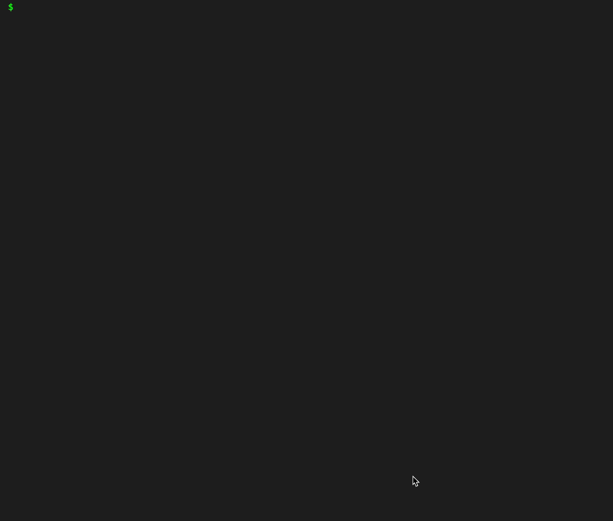

# Project Name

> Empower students with hands-on terminal skills through our web-based teaching tool. Enhance their CS education with real-world command line experience, all within a safe, accessible platform. Equip the next generation with critical tech skills — effortlessly, anywhere, anytime.

## Table of Contents

- [Introduction](#introduction)
- [Features](#features)
- [Installation](#installation)
- [Usage](#usage)
- [Commands](#commands)
- [License](#license)

## Features

- Basic Unix-like commands
- Command history search using a _Suffix Tree_. `CTRL+R`
- Spell-checking with Levenshtein Distance
- Command Autocomplete
- File Tree representation


## Installation

1. Clone the repository:
   ```bash
   git clone https://github.com/1MRUN/EducationalTerminal.github.io.git
   ```

## Usage

To run the project, run the `index.html` file locally. \
For example in WebStorm, locate `index.html` and select one of the browsers offered in the upper right corner. \
Alternatively, you can try the project out on our [Github Pages](https://1mrun.github.io/EducationalTerminal.github.io/).

## Commands

Describe any commands available in your project. Here's a sample list, which can be derived from your `commands.js`:

- `help`: Display available commands and their usage
- `clear`: Clear the terminal screen
- `pwd`: Print working directory
- `resetterm`: Reset the terminal session
- `ls`: List directory contents
- `cd`: Change directory
- `mkdir`: Create a new directory
- `rm`: Remove a file
- `rmdir`: Remove an empty directory
- `tree`: Display directory structure as a tree
- `touch`: Create a new empty file

## Testing

We decided to make testing interesting, so our unit tests are unique. \
Run the command `test` in the terminal to run the tests from [tests.js](tests.js) file.

## Demo

## Contributing to the project
It is straightforward to add your own commands! Register them under [commands.js](commands.js) file. \
It is highly encouraged!
